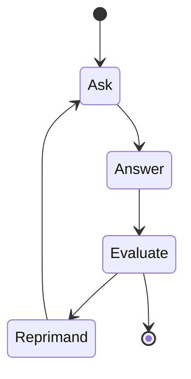

# Tutorial: Building Agents and Workflows with pydantic-ai and pydantic-graph

# https://github.com/aidiss/tutorial-building-agents-and-workflows-with-pydantic-ai

## Preparation

- Clone the repository `git clone git@github.com:aidiss/tutorial-building-agents-and-workflows-with-pydantic-ai.git`
- Install uv environment manager: https://docs.astral.sh/uv/getting-started/installation/
- Run `uv sync` to install the dependencies.
- Create `.env` file:
    - See `.env.example` for an example.
    - Make sure you have at least one llm model provider key.
    - Optional: add any other keys you need.
- Run `uv run basic_example.py` to test the setup.
- Optional (but recommended): Setup logging https://logfire.pydantic.dev/docs/#logfire
- Some reading:
    - Pydantic AI overview https://ai.pydantic.dev/
    - Pydantic AI Agents https://ai.pydantic.dev/agents/
    - Pydantic Graphs, for building Workflows https://ai.pydantic.dev/graph/

## What is next?

This repository will be updated at the start of the workshop.

## Troubleshooting

Raise an issue if you have any problems.


# Agenda

- Why pydantic stack? 5 min
- Agents with pydantic-ai 10 min
- Interactive coding session 15 min
- Workflows with pydantic-graph 10 min
- Interactive coding session 15 min
- Q&A 5 min
- Wrap up 5 min

## Intro: Why pydantic stack?


- Well, it's pydantic.
  - Python before type hints was a mess.
  - Let's use type hints to make our code more readable and maintainable.
- If someone would ask you what single library you would pick if you could only pick one, it would be pydantic.
- It is synonymous with modern python.
- The ecosystem: pydantic, pydantic-ai, pydantic-graphs, pydantic-evals, logfire
- https://pypistats.org/packages/pydantic


> PydanticAI is a Python agent framework designed to make it less painful to build production grade applications with Generative AI.


Has guts to say this:

> The Google SDK for interacting with the generativelanguage.googleapis.com API google-generativeai reads like it was written by a Java developer who thought they knew everything about OOP, spent 30 minutes trying to learn Python, gave up and decided to build the library to prove how horrible Python is. It also doesn't use httpx for HTTP requests, and tries to implement tool calling itself, but doesn't use Pydantic or equivalent for validation.


## 1. Agents with pydantic-ai

### What is an agent?

More than just a LLM.

- Agents are LLM calls in for loop. (?)
- AI Agents are programs where LLM outputs control the workflow. (Hugging Face, smolagents)
- An artificial intelligence (AI) agent refers to a system or program that is capable of autonomously performing tasks on behalf of a user or another system by designing its workflow and utilizing available tools. (IBM)
- Agents are systems where LLMs dynamically direct their own processes and tool usage, maintaining control over how they accomplish tasks. (Anhtropic)
- https://www.anthropic.com/engineering/building-effective-agents

### Agent 

- [BasicExample](.basic_example.py)
- [MultiAgent FlightBooking](./examples/flight_booking.py)
- [Question Graph](./examples/question_graph.py)
- [Weather Agent](./examples/weather_agent.py)


### Return schema


```py

class FlightDetails(BaseModel):
    """Details of the most suitable flight."""

    flight_number: str
    price: int
    origin: str = Field(description='Three-letter airport code')
    destination: str = Field(description='Three-letter airport code')
    date: datetime.date


class NoFlightFound(BaseModel):
    """When no valid flight is found."""

search_agent = Agent[Deps, FlightDetails | NoFlightFound](
    ...
    output_type=FlightDetails | NoFlightFound,
    ...
)
```

### Dependencies and Context

One of the common problems is managing dependencies, secrets, access.

Pydantic solved so good that Open AI Agent framework acknowledged it.

https://github.com/openai/openai-agents-python?tab=readme-ov-file#acknowledgements

[Sync Deps](./examples/sync_deps.py)

```py
@dataclass
class MyDeps:
    api_key: str
    http_client: httpx.Client
    database_key: str
    user_id: str
    user_name: str
```

```py
deps = MyDeps("foobar", httpx.Client())
    result = await agent.run(
        "Tell me a joke.",
        deps=deps,
    )
```

### Tools


```py
@agent.tool
def get_player_name(ctx: RunContext[MyDeps]) -> str:
    """Get the player's name."""
    return ctx.deps.user_name
```

### MultiAgent

Sometimes an agent with bunch of tools is not enough.

- [Joke Agent - Agent delegation/Router](./examples/joke_agent.py)
- [Flight Booking - Programmatic handoff](./examples/flight_booking.py)


## 2. More info on exercises

### Easy version

- Modify any of the existing examples.
  - Change the prompt.
  - Remove or add a tool.
  - Change the update schema.
  - Update dependencies.

### Harder version

- Deep research (Agent and Workflow)
- Q and A from scratch (Agent and Workflow)
- Tutor, that teaches you about a page (Agent and Workflow)
- File downloader (Agent and Workflow)


## 3. Build your own agent!

Build a simple agent, that
- uses a tool(s),
- has context,
- has managed agents.

You can vibe code or use any of the LLM coding tools.

But make sure you include documentations.

It is very fresh project and LLMs do not know it well.

## 4. Workflows with pydantic-graph

Agents vs Workflows

- Workflows are systems where LLMs and tools are orchestrated through predefined code paths.
- Agents, on the other hand, are systems where LLMs dynamically direct their own processes and tool usage, maintaining control over how they accomplish tasks.

Why go for workflows?

- Speed
- Accuracy
- Price
- Maintainability

### Node

```py
@dataclass
class Answer(BaseNode[QuestionState]):
    question: str

    async def run(self, ctx: GraphRunContext[QuestionState]) -> Evaluate:
        answer = input(f"{self.question}: ")
        return Evaluate(answer)

@dataclass
class Evaluate(BaseNode[QuestionState, None, str]):
    answer: str

    async def run(
        self,
        ctx: GraphRunContext[QuestionState],
    ) -> End[str] | Reprimand:
        assert ctx.state.question is not None
        result = await evaluate_agent.run(
            format_as_xml({"question": ctx.state.question, "answer": self.answer}),
            message_history=ctx.state.evaluate_agent_messages,
        )
        ctx.state.evaluate_agent_messages += result.all_messages()
        if result.output.correct:
            return End(result.output.comment)
        else:
            return Reprimand(result.output.comment)

```

### Graph

```py
Graph(
    nodes=(Ask, Answer, Evaluate, Reprimand), state_type=QuestionState
)
```

### State Persistence


```py
persistence = FileStatePersistence(Path("question_graph.json"))

```

[State Persistence](./question_graph.json)

###  Mermaid



## 5. Build your own workflow!

Task: Build a simple workflow, that updates a state, and has a graph representation.

- Modify one of the examples.
- Remember in many cases Agents and Workflows are interchangeable.
- Got an agent idea? Let me know, and I will help you build it.

```


```

## 6. Q&A


## Thanks

We do custom AI integrations: https://delves.ai/

We are hiring: aidiss@gmail.com


