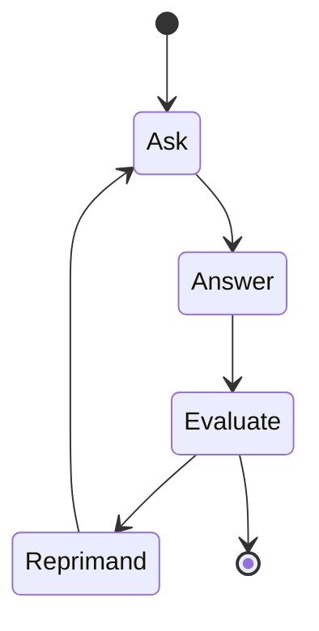

# Tutorial: Building Agents and Workflows with pydantic-ai and pydantic-graph

## Preparation

- Clone the repository `git clone git@github.com:aidiss/tutorial-building-agents-and-workflows-with-pydantic-ai.git`
- Install uv environment manager: https://docs.astral.sh/uv/getting-started/installation/
- Run `uv sync` to install the dependencies.
- Create `.env` file:
    - See `.env.example` for an example.
    - Make sure you have at least one llm model provider key.
    - Optional: add any other keys you need.
- Run `uv run basic_example.py` to test the setup.
- Optional (but recommended): Setup logging https://logfire.pydantic.dev/docs/#logfire
- Some reading:
    - Pydantic AI overview https://ai.pydantic.dev/
    - Pydantic AI Agents https://ai.pydantic.dev/agents/
    - Pydantic Graphs, for building Workflows https://ai.pydantic.dev/graph/

## What is next?

This repository will be updated at the start of the workshop.

## Troubleshooting

Raise an issue if you have any problems.


# Agenda

- Why pydantic stack? 5 min
- Agents with pydantic-ai 10 min
- Interactive coding session 15 min
- Workflows with pydantic-graph 10 min
- Interactive coding session 15 min
- Q&A 5 min
- Wrap up 5 min


## Intro: Why pydantic stack?

- Well, it's pydantic.
- If someone would ask you what single library you would pick if you could only pick one, it would be pydantic.
- It is synonymous with modern python.
- logfire.

### Notes

> The Google SDK for interacting with the generativelanguage.googleapis.com API google-generativeai reads like it was written by a Java developer who thought they knew everything about OOP, spent 30 minutes trying to learn Python, gave up and decided to build the library to prove how horrible Python is. It also doesn't use httpx for HTTP requests, and tries to implement tool calling itself, but doesn't use Pydantic or equivalent for validation.

https://pypistats.org/packages/pydantic


## 1. Agents with pydantic-ai

### Learn about agents

### What is an agent?

- https://www.anthropic.com/engineering/building-effective-agents

### Agent 

- [BasicExample](.basic_example.py)
- [MultiAgent FlightBooking](./examples/flight_booking.py)
- [Question Graph](./examples/question_graph.py)
- [Weather Agent](./examples/weather_agent.py)

### Dependencies and Context

[Sync Deps](./examples/sync_deps.py)

### Tools


```py
@agent.tool
def get_player_name(ctx: RunContext[str]) -> str:
    """Get the player's name."""
    return ctx.deps
```

### MultiAgent


[Joke Agent](./examples/joke_agent.py)
[Flight Booking](./examples/flight_booking.py)


## 2. More info on exercises

### Easy version
- Modify any of the existing examples.
  - Change the prompt.
  - Remove or add a tool.
  - Change the update schema.
  - Update dependencies.

### Harder version

- Deep research (Agent and Workflow)
- Q and A from scratch (Agent and Workflow)
- Tutor, that teaches you about a page (Agent and Workflow)
- File downloader (Agent and Workflow)


## 3. Build your own agent!


Task:
Build a simple agent, that uses a tool(s), has context, and has managed agents.


## 4. Workflows with pydantic-graph

Why go for workflows?

- Speed
- Accuracy
- Price
- Maintainability

## Learn about workflows

### GraphRunContext


### Node

```py
@dataclass
class Answer(BaseNode[QuestionState]):
    question: str

    async def run(self, ctx: GraphRunContext[QuestionState]) -> Evaluate:
        answer = input(f"{self.question}: ")
        return Evaluate(answer)

@dataclass
class Evaluate(BaseNode[QuestionState, None, str]):
    answer: str

    async def run(
        self,
        ctx: GraphRunContext[QuestionState],
    ) -> End[str] | Reprimand:
        assert ctx.state.question is not None
        result = await evaluate_agent.run(
            format_as_xml({"question": ctx.state.question, "answer": self.answer}),
            message_history=ctx.state.evaluate_agent_messages,
        )
        ctx.state.evaluate_agent_messages += result.all_messages()
        if result.output.correct:
            return End(result.output.comment)
        else:
            return Reprimand(result.output.comment)

```

### Graph

```py
Graph(
    nodes=(Ask, Answer, Evaluate, Reprimand), state_type=QuestionState
)
```


### State Persistence


```py
persistence = FileStatePersistence(Path("question_graph.json"))

```

[State Persistence](./question_graph.json)

###  Mermaid


Task: Build a simple workflow, that updates a state, and has a graph representation.



## 5. Build your own workflow!

- Modify one of the examples.
- Remember in many cases Agents and Workflows are interchangeable.
- Got an agent idea? Let me know, and I will help you build it.


## 6. Q&A